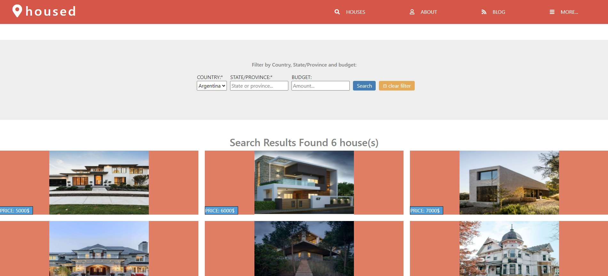

# NewsWeek-Site-clone-

**This Page is my first capstone project for Microverse**

# Getting started :

I'm very excited to say that this is my first CapStone project for Microverse, about HTML and CSS. To be honest I really enjoyed
working on this project. I used all of my knowledge from the past weeks to make this since semantics tags to pseudo-selectors, gradients, responsive tecnhique, flexbox, grid, bootstrap, linking different pages and work by myself!

The purpose of this project is to create a similar looking webpage like the "client" ask for. In this case the honorables TSE are my "client".

So I had to clone the layout and desing from the screenshots that I received using everything that I learned from the HTML&CSS module.

To visit the page go to the [Live Demo Link](https://fdi96.github.io/HTML-CSS-CapstoneProject/)

# Prerequisites :

1- A Computer.

2 - An internet browser.

## BUILT WITH

    -HTML
    -CSS

## LIVE DEMO

[Live Demo Link](https://fdi96.github.io/HTML-CSS-CapstoneProject/)

## AUTHOR

👤 **Federico Ignacio Lopez Cechini**

- GitHub: [@FdI96](https://github.com/FdI96)
- Twitter: [@federicolopezc7 ](https://twitter.com/federicolopezc7)
- LinkedIn: [Federico Ignacio](https://www.linkedin.com/in/federico-ignacio-3285411a4/)

## SHOW YOUR SUPPORT

**Give a ⭐️ if you like this project!**

## 🤝 Contributing

Contributions, issues, and feature requests are welcome!

Feel free to check the issues page. Show your support

Give a ⭐️ if you like this project!

## 📝 Licensed MIT

This project is  licensed.
